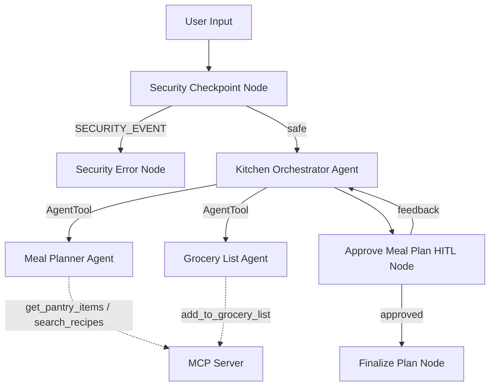

# Submission Write-Up: Smart Meal Prep Assistant

## Problem Statement

Meal planning and grocery shopping are time-consuming chores. Many individuals struggles to maintain balanced diets, reduce food waste, and plan recipes using whatever is currently in their fridge and pantry. Typical recipe apps require manual entry, don't keep track of pantry inventory, and offer static recommendations that fail to adjust dynamically based on customized family preferences or safety guardrails. 

The **Smart Meal Prep Assistant** solves this by offering an ambient, secure, and interactive culinary planner that knows what's in the kitchen (via MCP pantry logs), generates customized menus, automatically writes back shopping lists, and securely checks all inputs to block prompt injection and filter sensitive data.

## Solution Architecture

The system uses a graph-based multi-agent architecture built with the **ADK 2.0 Workflow API**:

## Concepts Used

1. **ADK Workflow Graph API (ADK 2.0)**:
   - Configured in [agent.py](file:///c:/Users/gtmap/OneDrive/Desktop/AI%20Agent/workspace/smart-meal-prep/app/agent.py#L170-L186) using named function nodes, routed edges, loops, and state schemas.
2. **LlmAgent**:
   - Three specialized `LlmAgent` instances built in [agent.py](file:///c:/Users/gtmap/OneDrive/Desktop/AI%20Agent/workspace/smart-meal-prep/app/agent.py#L37-L77) for orchestrated delegation.
3. **AgentTool**:
   - Used by the Orchestrator to call `meal_planner` and `grocery_list_generator` specialists dynamically as tools.
4. **MCP Server**:
   - Built in [mcp_server.py](file:///c:/Users/gtmap/OneDrive/Desktop/AI%20Agent/workspace/smart-meal-prep/app/mcp_server.py) using the MCP Python SDK, enabling stdio-based external tool access to physical resources (grocery files, mock database).
5. **Security Checkpoint**:
   - A function node [agent.py:L79-L135](file:///c:/Users/gtmap/OneDrive/Desktop/AI%20Agent/workspace/smart-meal-prep/app/agent.py#L79-L135) checking inputs before LLM invocation.
6. **Agents CLI**:
   - Project structured, scaffolded, and tested locally using `agents-cli`.

## Security Design

1. **PII Scrubbing**:
   - Replaces user emails and telephone numbers with generic tags (`[REDACTED_EMAIL]`, `[REDACTED_PHONE]`) to ensure personal information is never sent to external LLM providers.
2. **Prompt Injection Mitigation**:
   - Uses strict keyword checks to detect standard jailbreak vectors (e.g. "ignore instructions", "developer mode"). Any detection routes requests immediately to `security_error_node`.
3. **Domain Verification Guardrail**:
   - Block requests containing non-culinary terms (e.g., malware, weapons, explosives, hacking) ensuring the assistant remains strictly focused on meal planning.
4. **Structured JSON Audit Logging**:
   - Outputs JSON records of every security decision with levels `INFO` or `CRITICAL` detailing scrubbed status and check results, easing debugging and observability.

## MCP Server Design

Exposes three robust domain tools:
1. `get_pantry_items`: Fetches the mock list of raw ingredients currently in stock. Used by `meal_planner` to design menus.
2. `search_recipes`: Searches the recipe catalog for matches. Used by `meal_planner` to pull step-by-step directions.
3. `add_to_grocery_list`: Records shopping items in `grocery_list.txt`. Used by `grocery_list_generator` to save lists.

## Human-in-the-Loop (HITL) Flow

A `RequestInput` interrupt occurs at `approve_meal_plan` in [agent.py:L141-L167](file:///c:/Users/gtmap/OneDrive/Desktop/AI%20Agent/workspace/smart-meal-prep/app/agent.py#L141-L167). It holds execution and outputs:
> *"Here is your proposed meal plan and grocery list. Do you approve? (Reply 'yes' to finalize, or specify any adjustments you want)."*

This prevents the assistant from finalizing incorrect lists or auto-ordering without human validation.

## Demo Walkthrough

Refer to the test cases in [README.md](file:///c:/Users/gtmap/OneDrive/Desktop/AI%20Agent/workspace/smart-meal-prep/README.md#L62-L110):
- **Scenario 1**: Requesting meal plans correctly accesses MCP pantry listings and initiates approval holds.
- **Scenario 2**: Submitting feedback loops execution back to Orchestrator to revise recipes.
- **Scenario 3**: Submitting prompt injections immediately halts execution at the Security Checkpoint.

## Impact / Value Statement

The Smart Meal Prep Assistant saves users estimated hours per week in recipe searching and list writing. It directly addresses the global food waste problem by building meal schedules based on ingredients that are about to expire. Furthermore, its enterprise-grade security architecture ensures it is safe for integration in corporate consumer portals.
